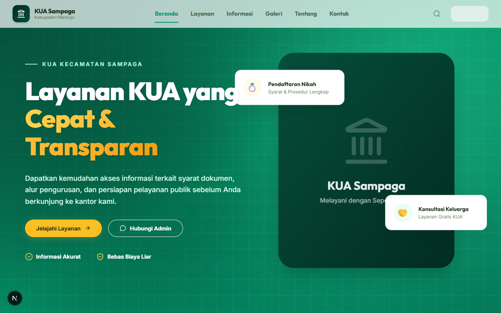
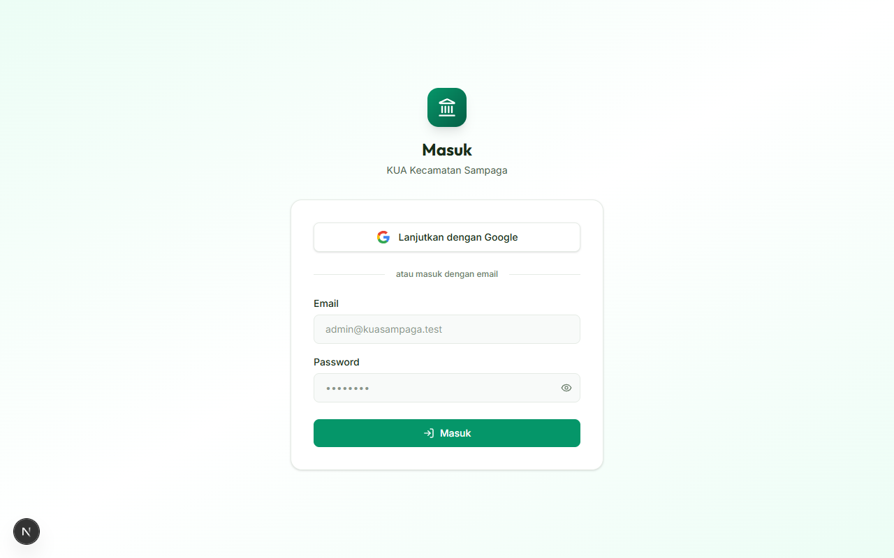
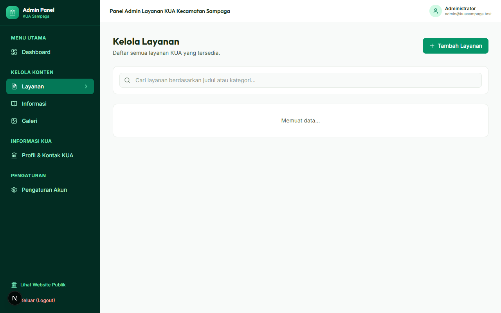
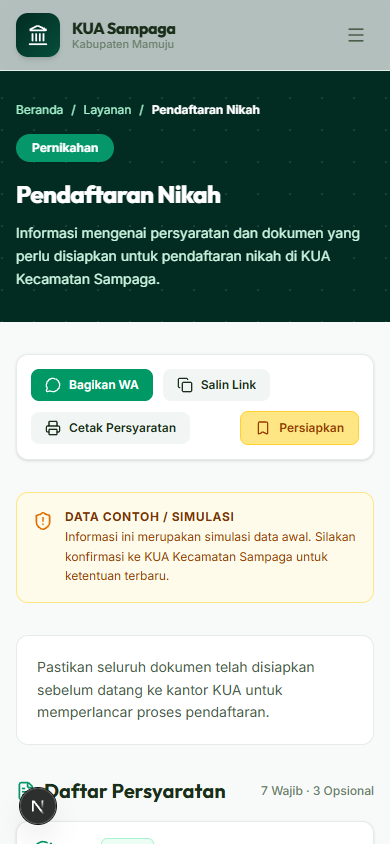

# Panduan Sistem Informasi KUA Kecamatan Sampaga

File ini berisi panduan lengkap mengenai website KUA Kecamatan Sampaga, dibagi menjadi dua bagian: **Bagian 1** untuk Pengguna Umum/Klien, dan **Bagian 2** untuk Tim IT/Pengembang.

---

## BAGIAN 1: Panduan Penggunaan (Untuk Pegawai & Warga)

Selamat datang di Website KUA Kecamatan Sampaga! Panduan ini dibuat dengan bahasa yang sangat sederhana agar Bapak/Ibu, baik sebagai pegawai KUA maupun sebagai warga, dapat menggunakan website ini dengan mudah.

### A. Cara Masuk (Login) ke Dalam Website

Untuk bisa menggunakan fitur-fitur penting, Bapak/Ibu harus "Masuk" (Login) terlebih dahulu.

1. Buka website KUA Sampaga.
2. Di pojok kanan atas layar, klik tombol **"Masuk"**.
3. **Paling Mudah:** Klik tombol **"Lanjutkan dengan Google"**. Jika Bapak/Ibu sudah login email di HP Android atau Laptop, otomatis akan langsung masuk tanpa perlu repot mengetik password!
4. **Cara Manual:** Jika ingin pakai email yang didaftarkan oleh admin, ketik email dan password di kolom yang disediakan.

> **Akun Percobaan (Jika ingin mencoba-coba sekarang):**
> - 👨‍💼 **Untuk Pegawai (Admin):** Ketik email `admin@kuasampaga.test` dan password `password`
> - 🧑 **Untuk Warga (User):** Ketik email `user@kuasampaga.test` dan password `password`

*(Catatan: Pegawai yang menggunakan email `sampagakua@gmail.com` akan otomatis menjadi Admin Utama).*

---

### B. Panduan Untuk Pegawai KUA (Admin)

Jika Bapak/Ibu masuk sebagai Admin, Bapak/Ibu bertugas untuk mengatur isi website.

1. Setelah login, Bapak/Ibu akan masuk ke halaman khusus bernama "Dashboard Admin".
2. Lihat menu di sebelah kiri layar, klik tulisan **"Layanan"**.
3. Klik tombol biru bertuliskan **"Tambah Layanan"**.
4. Isi nama layanannya apa, biayanya berapa, dan syarat-syaratnya apa saja. Jika sudah selesai, klik tombol **"Simpan"** di paling bawah.

**Mengatur Berita (Informasi) & Foto Galeri:**
Sama seperti menambah layanan, Bapak/Ibu tinggal klik menu **"Informasi"** atau **"Galeri"** di sebelah kiri. Lalu klik tulisan tambah, masukkan teks atau foto, dan simpan. Semudah mengetik pesan di WhatsApp!

---

### C. Panduan Untuk Warga (Masyarakat Umum)

Ini adalah panduan untuk warga yang ingin mengurus surat-surat ke KUA. Website ini sangat membantu agar warga tidak bolak-balik ke kantor KUA hanya karena ada syarat yang tertinggal.

**Cara Mencari Tahu Syarat Layanan:**
1. Di halaman awal (Beranda), klik menu **"Layanan"** di atas.
2. Pilih layanan yang ingin diurus, misalnya **"Pendaftaran Nikah"**.
3. Di situ Bapak/Ibu bisa membaca dengan jelas semua syarat yang harus dibawa ke kantor (seperti KTP, KK, Pas Foto, dll).

**Tombol "Persiapkan" (Fitur Sangat Berguna!):**
1. Saat membaca syarat layanan, Bapak/Ibu akan melihat tombol hijau bertuliskan **"Persiapkan"**.
2. Silakan diklik! *(Catatan: Pastikan sudah "Masuk" pakai Google sebelumnya)*.
3. Setelah diklik, website akan otomatis membawa Bapak/Ibu ke halaman Profil pribadi.
4. Di profil tersebut, akan muncul daftar syarat tadi yang dilengkapi dengan **Kotak Centang (Ceklis)**.
5. Sambil mencari dokumen di rumah, Bapak/Ibu bisa memencet kotak tersebut di HP. Misalnya: KTP sudah ada? Centang. KK sudah difotokopi? Centang.

> **Penting!** Jika semua kotak sudah dicentang, lingkarannya akan penuh 100% dan muncul tulisan **"Dokumen Lengkap"**. Artinya, semua syarat sudah siap dan Bapak/Ibu tinggal berangkat ke KUA!

**Cara Bertanya ke Petugas via WhatsApp:**
Jika ada syarat yang kurang jelas, tidak perlu repot menyimpan nomor KUA. Di setiap halaman layanan, ada tombol **"Konsultasi via WhatsApp"**. Cukup diklik, maka otomatis aplikasi WhatsApp di HP Bapak/Ibu akan terbuka dan langsung bisa mengirim pesan ke petugas KUA Sampaga.

---

## BAGIAN 2: Panduan Teknis (Untuk Tim IT / Pengembang)

Bagian ini ditujukan bagi tim IT yang akan melakukan *maintenance*, memodifikasi kode, atau mendeploy ulang aplikasi.

### 1. Teknologi yang Digunakan (Tech Stack)
- **Framework**: Next.js 16.3 (App Router) + Turbopack
- **Bahasa**: TypeScript
- **Styling**: Tailwind CSS
- **Database**: PostgreSQL (diakses melalui Prisma ORM)
- **Autentikasi**: NextAuth.js (Google Provider & Credentials Provider)
- **Penyimpanan File**: Lokal (folder `public/uploads`)

### 2. Struktur Database (Prisma Schema)
Aplikasi ini memiliki beberapa tabel utama:
- `User`: Menyimpan data pengguna biasa dan admin (dibedakan dengan kolom `role`).
- `Service`: Menyimpan daftar layanan KUA (seperti Pendaftaran Nikah).
- `Requirement`: Syarat-syarat untuk masing-masing layanan (berelasi *one-to-many* dengan `Service`).
- `Information`: Untuk berita atau pengumuman.
- `GalleryItem`: Untuk galeri foto KUA.
- `SavedService`: Fitur untuk warga agar bisa mencentang dokumen yang sudah siap (berelasi antara `User` dan `Service`).
- `SavedRequirement`: Menyimpan status *ceklis* per syarat dokumen untuk tiap user.

### 3. Cara Menjalankan di Komputer Lokal (Localhost)
Jika pengembang baru ingin melanjutkan proyek ini, ikuti langkah berikut:

1. **Buka Terminal** dan masuk ke folder proyek `layanan-kua-mamuju`.
2. **Install Dependensi:** Jalankan perintah `npm install`
3. **Database:** Pastikan Anda memiliki URL database PostgreSQL. Ubah file `.env` di baris `DATABASE_URL` dengan milik Anda.
4. **Push Database:** Jalankan perintah `npx prisma db push` untuk membuat tabel-tabel di database kosong.
5. **Jalankan Aplikasi:** Jalankan `npm run dev` lalu buka `http://localhost:3000` di browser.

### 4. Akun Admin Default
Saat database masih kosong dan aplikasi baru dijalankan, Anda bisa mendaftar (Sign Up) menggunakan email `sampagakua@gmail.com`. Sistem sudah diprogram agar email tersebut otomatis diberikan hak akses / role sebagai **ADMIN**. Anda bisa menggunakannya untuk login pertama kali.
